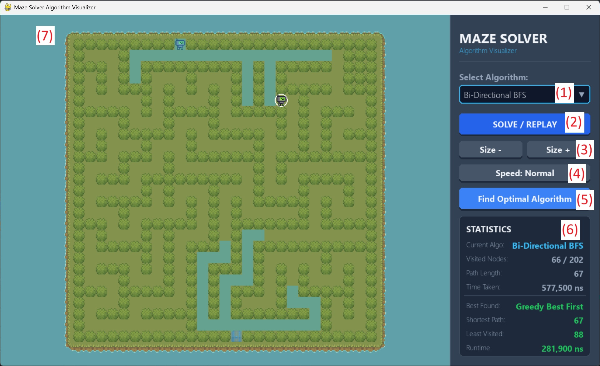

# Maze Solver

Command-line interface and library for experimenting with grid-based maze solvers (BFS, DFS, bi-BFS, Dijkstra, A*, Greedy, dead-end filling, and agent algorithms).

## Quick Start
To begin, install requirements, then run the app.py file.

### Windows
```bash
python3 -m venv venv
venv/Scripts/pip install -r requirements.txt
```
### Mac
```bash
python3 -m venv venv
venv/bin/pip install -r requirements.txt
```

### Start
To start, run app.py. Refer to the image below for further instructions.

1. Select algorithm from dropdown
1. Click to replay solving
1. Increase or decrease maze size (all stats will be wiped)
1. Change solving animatioon speed
1. Find the best solving algorithm for the current maze
1. Current and current best statistics
1. Window for viewing solving animation
